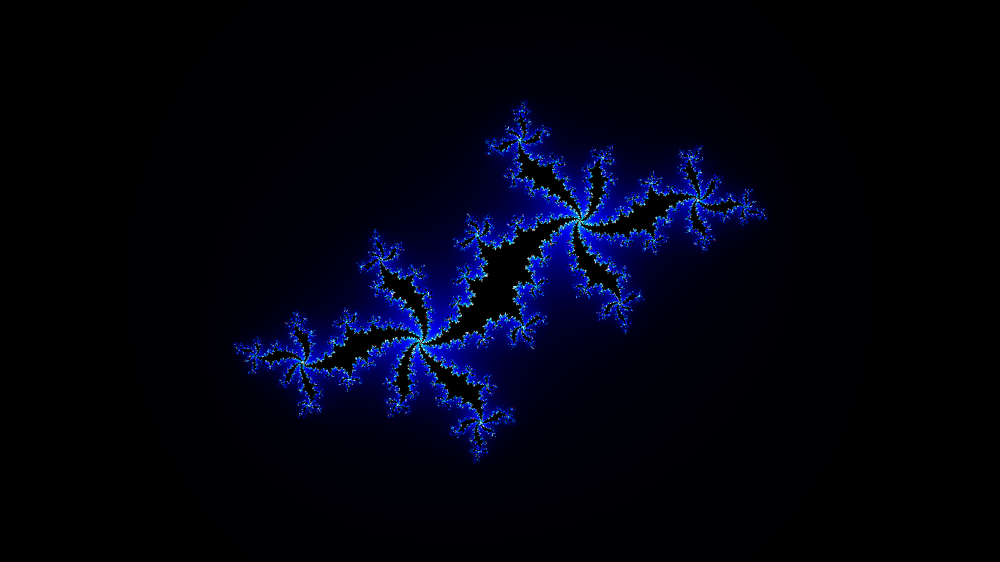

# Fractage Documentation

## Endpoints

All query parameters are optional.

### Fractals

### Cantor Dust

```yaml
http://localhost:6060/cantor-dust
```

#### Parameters

+ **iterations:**
  + _Definition:_ The number of iterations that should be displayed.
  + _Type:_ [Integer](#integer-type)
  + _Range:_ 0 to 25 inclusive.
  + _Default:_ 5
+ **color:**
  + _Definition:_ The color for drawing the boxes.
  + _Type:_ [Color](#color-type)
  + _Default:_ random colors.

#### Sample


### Cantor Set

```yaml
http://localhost:6060/cantor-set
```

#### Parameters

+ **iterations:**
  + _Definition:_ The number of iterations that should be displayed.
  + _Type:_ [Integer](#integer-type)
  + _Range:_ 0 to 25 inclusive.
  + _Default:_ 5
+ **line_height:**
  + _Definition:_ The height of each line.
  + _Type:_ [Integer](#integer-type)
  + _Range:_ 0 to 30 inclusive.
  + _Default:_ 5
+ **color:**
  + _Definition:_ The color for drawing the lines.
  + _Type:_ [Color](#color-type)
  + _Default:_ random colors.

#### Sample


### Julia Set

```yaml
http://localhost:6060/julia-set
```

#### Parameters

+ **iterations:**
  + _Definition:_ The maximum number of iterations that should performed for each pixel.
  + _Type:_ [Integer](#integer-type)
  + _Range:_ 0 to 500,000 inclusive.
  + _Default:_ 250
+ **c:**
  + _Definition:_ The value of $c$ in the equation $z = z^2 + c$.
  + _Type:_ [Complex](#complex-type)
  + _Default:_ -0.5 + 0.6i
+ **bail_out:**
  + _Definition:_ The value at which the series diverges.
  + _Type:_ [Float](#float-type)
  + _Default:_ 2
+ **region:**
  + _Definition:_ The region of the infinite plane to display.
  + _Type:_ [Rectangle](#rectangle-type)
  + _Default:_ -1.5, -1.5, 3, 3
+ **color_palette:**
  + _Definition:_ The color palette for coloring the pixels.
  + _Type:_ [ColorPalette](#color-palette-type)
  + _Default:_ orange_blue.

#### Sample



### Sierpinski Carpet

```yaml
http://localhost:6060/sierpinski-carpet
```

#### Parameters

+ **iterations:**
  + _Definition:_ The number of iterations that should be displayed.
  + _Type:_ [Integer](#integer-type)
  + _Range:_ 0 to 25 inclusive.
  + _Default:_ 5
+ **color:**
  + _Definition:_ The color for drawing the boxes.
  + _Type:_ [Color](#color-type)
  + _Default:_ random colors.

#### Sample


### Sierpinski Triangle

```yaml
http://localhost:6060/sierpinski-triangle
```

#### Parameters

+ **iterations:**
  + _Definition:_ The number of iterations that should be displayed.
  + _Type:_ [Integer](#integer-type)
  + _Range:_ 0 to 25 inclusive.
  + _Default:_ 5
+ **color:**
  + _Definition:_ The color for drawing the triangles.
  + _Type:_ [Color](#color-type)
  + _Default:_ random colors.

#### Sample


## Type Definitions

### Integer Type

**Format:** `(+|-)?[0-9]+`<br/>
**Definition:** A 64-bit signed integer.<br/>
**Alias:** `<int>`<br/>
**Example:** `768`

### Float Type

**Format:** `(+|-)?[0-9]+(.[0-9]+)?`<br/>
**Definition:** A 64-bit floating or fractional number.<br/>
**Alias:** `<float>`<br/>
**Example:** `7.68`

### Complex Type

**Format:** `<float>([+-]<float>i)?`<br/>
**Definition:** A complex number consisting of 64-bit floating point real and imaginary parts.<br/>
**Alias:** `<cmplx>`<br/>
**Example:** `7.68 + 3i`

### Color Type

**Alias:** `<color>`

#### Variant 1

**Format:** `rgb(<int>, <int>, <int>)` or `rgba(<int>, <int>, <int>, <int>)`<br/>
**Definition:** A color defined using the `rgb` or `rgb` format, where the `<int>` values are in the range 0-255 inclusive.<br/>
**Example:** `rgb(125, 25, 35)`

#### Variant 2

**Format:** `#[0-9a-f]+`<br/>
**Definition:** A color defined using the hexa-decimal format, where the values are integers in the range 0-255 inclusive but written in the hexa-decimal format.<br/>
**Example:** `#2233aa` or `#23a`

#### Variant 3

**Format:** `[a-zA-Z_]+`<br/>
**Definition:** A named color that has been defined in [colors.yaml](src/data/colors.yaml).<br/>
**Example:** `slategray`

### Rectangle Type

**Alias:** `<rect>`

#### Variant 1

**Format:** `<float>, <float>, <float>, <float>`<br/>
**Definition:** 4 comma-separated float values representing the _x_ position, _y_ position, _width_ and _height_ of a rectangular area.<br/>
**Example:** `1.13, 2, 9.8, 7`

#### Variant 2

**Format:** `<float>, <float>`<br/>
**Definition:** 2 comma-separated float values representing the _width_ and _height_ of a rectangular area. The _x_ and _y_ positions would be 0.<br/>
**Example:** `7.68, 7.86`

### Polynomial Type

**Format:** `(<float>([a-zA-Z](^<int>)?)?)+`<br/>
**Definition:** A simple polynomial expression.<br/>
**Alias:** `<poly_expr>`<br/>
**Example:** `3 + 2.3x - x^5` for $3 + 2.3x - x^5$

### Color Palette Type

**Alias:** `<color_palette>`

#### Variant 1

**Format:** `[a-zA-Z_]+`<br/>
**Definition:** A named color palette that has been defined in [color_palettes.yaml](src/data/color_palettes.yaml).<br/>
**Example:** `orange_blue`

#### Variant 2

**Format:** `("<color>", <float>,)+`<br/>
**Defininition:** A comma-separated list of colors and positions in increasing order. Each position has to be a `<float>` type in the range of 0 to 1 inclusive. Colors defined using the `rgb` format should be enclosed in double quotes.<br/>
**Example:** `slategray, 0.0, %23808080, 0.45, %22rgb(200, 200, 200)%22, 1.0`
