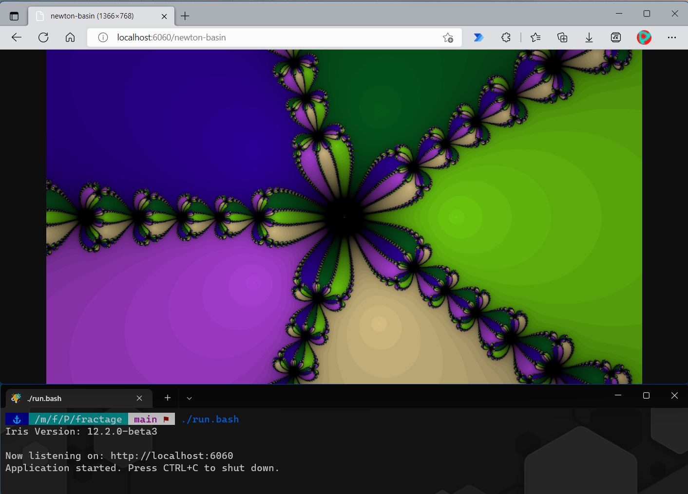

# Fractage

[](https://github.com/B3zaleel/fractage/actions/workflows/build.yml)

Fractage is a fractal image generation service written in Golang.



## Requirements

+ Go (version 1.18+)

## How To Use

Run the command below using your Linux/WSL terminal. Uninstalled modules should be downloaded on your system before the program starts for the first time.

```powershell
./run.bash
```

See [Documentation](DOCUMENTATION.md) for more details about the supported fractals and endpoints.

## Related Projects

+ [BeautifulFractals](https://github.com/alex-titarenko/beautifulfractals)
